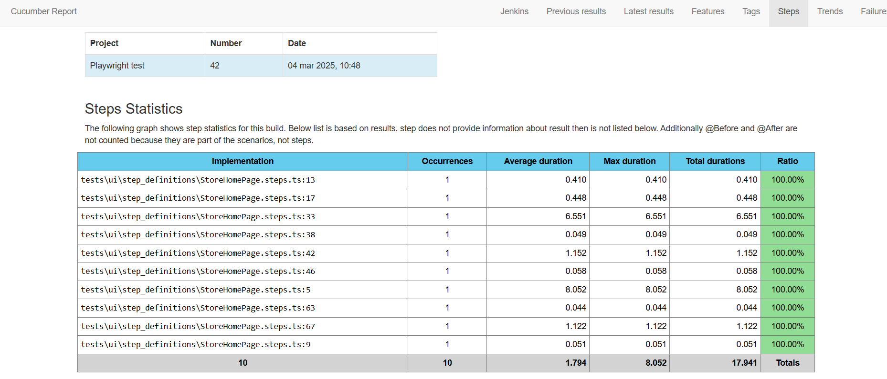

# Cucumber with Playwright Framework

This repository demonstrates how to set up and run end-to-end tests using Cucumber and Playwright. It provides a structured approach to writing and executing tests for web applications.

## System Requirements

- **Node
- **Jenkins


## Installation

1. Clone the repository:

   ```bash
   git clone <repository-url>
   cd <repository-folder>
   ```

2. Install dependencies:

   ```bash
   npm install
   npx playwright install
   ```

## Running Tests
1. To execute the tests, use the following command:
   ```bash
   npm run test
   ```
###### This command performs the following actions:
###### - require-module ts-node/register: Registers TypeScript support.
###### - require ./tests/ui/support/hooks.ts: Includes setup hooks before tests run.
###### - require ./tests/ui/step_definitions/*.ts: Loads step definitions for the tests.
###### - format progress-bar: Displays a progress bar during test execution.
###### - ./tests/ui/features/*.feature: Specifies the location of feature files to execute.
###### - generate html reports


## Project Structure

```bash
.
├── tests/
│   └── ui/
│       ├── features/
│       │   └── *.feature
│       ├── pages/
│       │   └── AbstractaStorePage.ts
│       ├── step_definitions/
│       │   └── StoreHomePage.steps.ts
│       └── support/
│           └── hooks.ts
├── reports/
├── package.json
├── cucumber.js
├── generateReport.js
├── Jenkinsfile
├── README.md
├── playwright.config.ts
└── tsconfig.json


```
- tests/: Contains test scripts that utilize Playwright for browser automation.
- features/: Contains Gherkin feature files and corresponding step definitions.
- pages/: Define pages url and locators
- step_definitions/: Implements the steps defined in feature files.
- support/: Define support file (hooks and utils files)
- package.json: Manages project dependencies and scripts.
- playwright.config.js: Configures Playwright settings.
- cucumber.js: Configures Cucumber settings.
- Jenkinsfile: Define file for pipeline execution

## CI/CD Integration

When integrating with Jenkins or other CI/CD tools(ensure cucumber report plugin is installed on jenkins):
1. Publish HTML Reports:
```bash
   post {
    always {
        script {
            if (fileExists('reports/cucumber-report.json')) {
                cucumber 'reports/cucumber-report.json'
            } else {
                echo "Cucumber JSON not found"
            }
        }
    }
   }
   ```
This configuration saves the report as a build artifact in Jenkins.

Additional Notes
- Installing Node Modules in CI/CD:

In your CI/CD pipeline, ensure that npm install is run before executing tests to install all necessary dependencies:
```bash
  stage('Install Dependencies') {
    steps {
        script {
            sh 'npm install'
        }
    }
}


   ```

This step installs the packages listed in package.json, ensuring that all required modules are available during test execution.


## Reports
After the test completes, the user can run:
```bash
   npm run generateReport
   ```
Test execution reports are generated in the ./reports directory. You can open the cucumber_report.html file in your browser to view a detailed summary of the results.

- Report examples:


## Jenkins Reports
- Using cucumber report plugin on the Jenkins pipeline can create html report that will be available on the Jenkins pipeline dashboard:


- Report statistics can be viewed on the cucumber report section:




Feel free to contribute to this framework or report issues via the repository's issue tracker.

##

 ###### Author: Alejandro Rios 